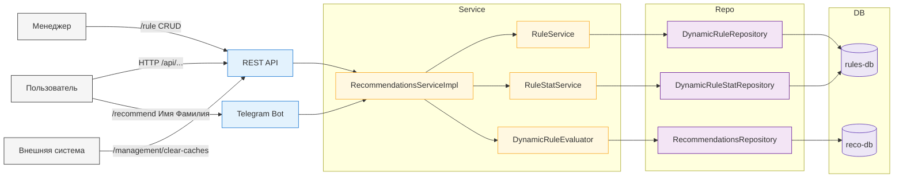
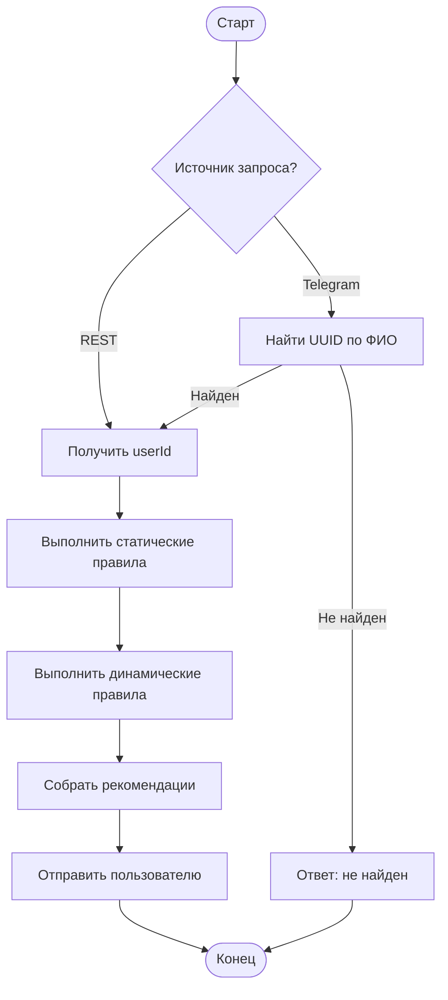

# Архитектура

Этот документ описывает ключевые компоненты приложения **finance_recommendations**, их взаимодействие и алгоритм формирования рекомендаций.

## 📘 Обзор
Приложение предоставляет рекомендации пользователям на основе статических и динамических правил.
Взаимодействие с системой возможно через REST API и Telegram-бота.
Данные берутся из двух источников: **rules-db** (основная) и **reco-db** (read-only).

## 🧩 Диаграмма компонентов

## ⚙️ Диаграмма активности

## 🧠 Компоненты
- **RecommendationsController** — отдаёт рекомендации.
- **DynamicRecommendationsController** — только динамические.
- **RuleController** — CRUD правил.
- **ManagementController** — очистка кешей.
- **RuleService / RuleStatService / DynamicRuleEvaluator** — бизнес-логика.
- **DynamicRuleRepository / RecommendationsRepository** — доступ к данным.
