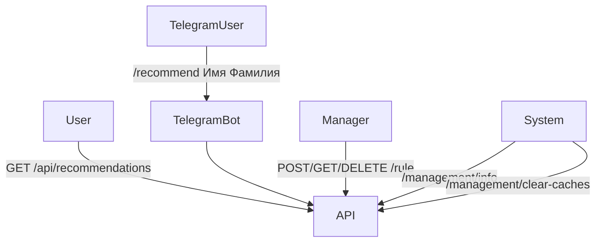

# 📋 Требования и Use Cases

## 🎯 User Stories

| ID | Описание |
|----|-----------|
| US-01 | Как пользователь, я хочу получать рекомендации через `/api/recommendations/{userId}`. |
| US-02 | Как пользователь Telegram, я хочу получить рекомендации по команде `/recommend`. |
| US-03 | Как менеджер, я хочу управлять динамическими правилами через `/rule`. |
| US-04 | Как внешняя система, я хочу очищать кеши через `/management/clear-caches`. |
| US-05 | Как служба мониторинга, я хочу получать информацию о версии через `/management/info`. |

---

## ⚙️ Нефункциональные требования

| ID | Требование |
|----|-------------|
| NFR-01 | Время отклика API ≤ 500 мс. |
| NFR-02 | Используется кеширование. |
| NFR-03 | Настройки передаются через переменные окружения. |
| NFR-04 | Приложение устойчиво к сбоям Telegram API. |

---

## 🧩 Диаграмма вариантов использования
